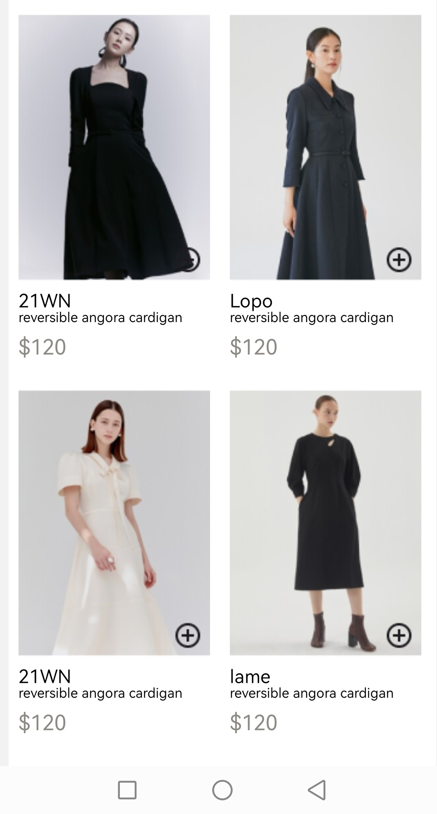
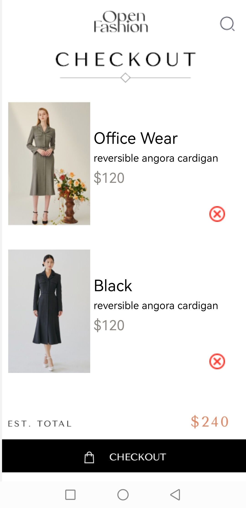
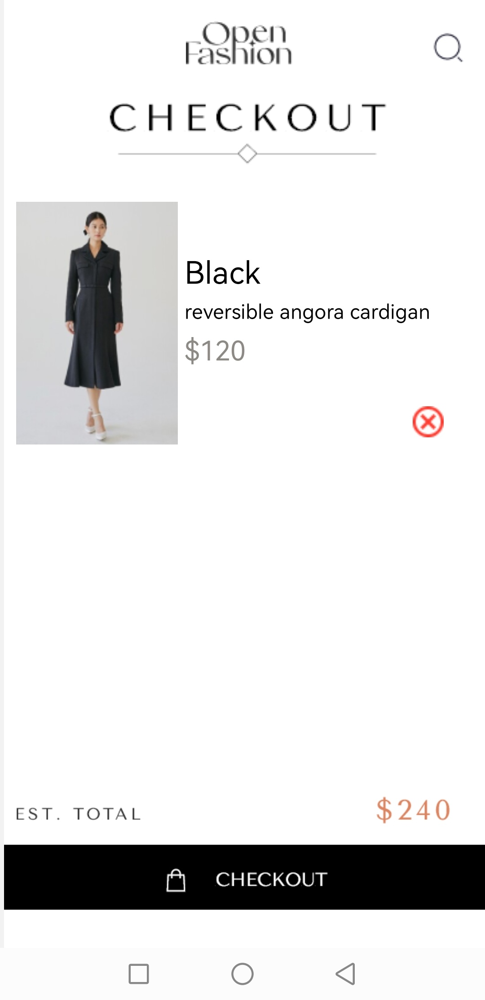

# rn-assignment6-11068463
This is a simple shopping cart application built using React Native. The app allows users to add and remove items from the cart and navigate between the home screen and the cart screen.

## Functionality Description

1. **Add to cart:** Implemented using AsyncStorage. Triggered by the onPress event of the add circle image.

2. **Remove from cart:**  Implemented using AsyncStorage. Triggered by the onPress event that removes the product using the index passed to it.

3. **Screen Navigation:** Implemented using Stack Navigation. Triggered by the onPress event of the shopping bag image.

